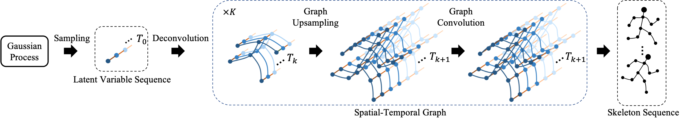
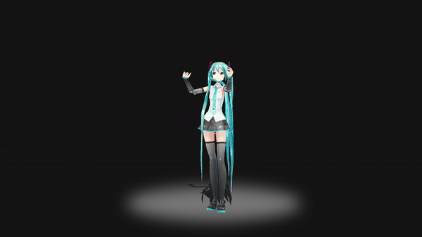

# Convolutional Sequence Generation Networks

This repository hold the codebase for our ICCV19 paper:
> **Convolutional Sequence Generation for Skeleton-Based Action Synthesis**, Sijie Yan, Zhizhong Li, Yuanjun Xiong, Huahan Yan,Dahua Lin, ICCV 2019.

    

[[Paper]](http://www.dahualin.org/publications/dhl19_csgn.pdf) [[Video]](https://www.youtube.com/watch?v=RU8OJ1YkxYw) [[Demo]](http://sijieyan.com/project/csgn)

### Dancing Generation

    

Watch the full video on [youtube](https://www.youtube.com/watch?v=RU8OJ1YkxYw) or [bilibili](https://www.bilibili.com/video/av73976030) .

### Demo

    

An [interactive demo](http://sijieyan.com/project/csgn) for action generation, prediction and completion on the NTU-RGB+D dataset.

### Code & Dataset
Code and Dataset are coming soon.