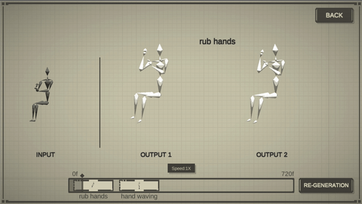

# Convolutional Sequence Generation Networks

This repository hold the codebase for our ICCV19 paper:
> **Convolutional Sequence Generation for Skeleton-Based Action Synthesis**, Sijie Yan, Zhizhong Li, Yuanjun Xiong, Huahan Yan,Dahua Lin, ICCV 2019.

    

Watch the full video on [[youtube]](https://www.youtube.com/watch?v=RU8OJ1YkxYw) or [[bilibili]](https://www.bilibili.com/video/av73976030) .

### Code & Dataset
Code and Dataset are coming soon.